# Zabbix-WEB端操作流程图解

## 第一步打开仪表盘查看安装状态及版本信息
## 仪表盘页面创建在LNSP一键部署脚本中完成（Second-LNSP-install.md文件查看代码）

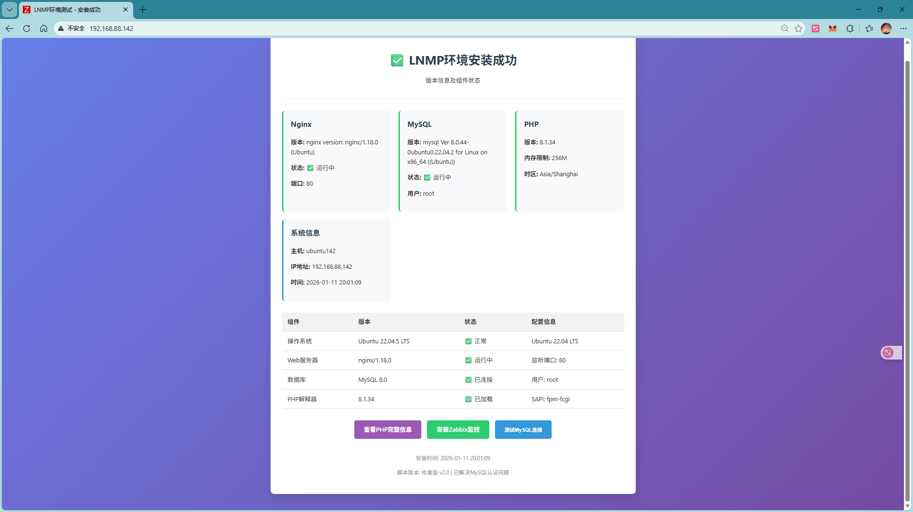

## 验证PHP页面是否成功

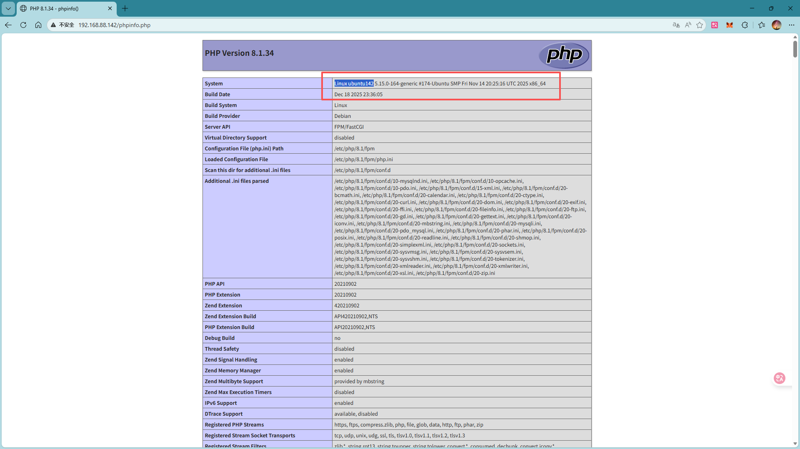

## 查看mysql信息

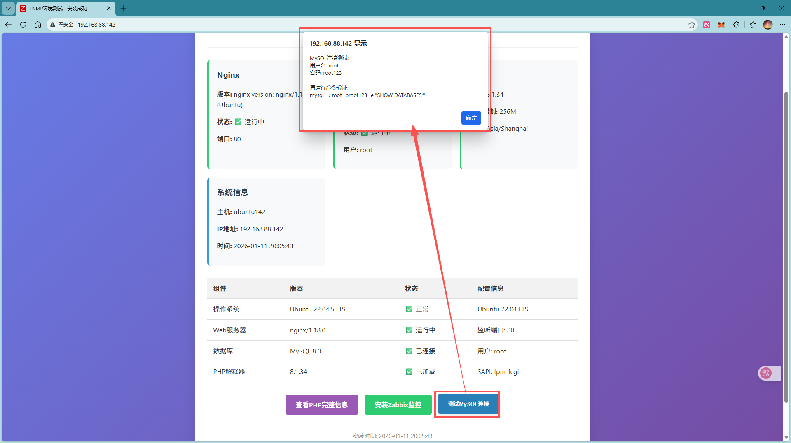

## zabbix-web安装

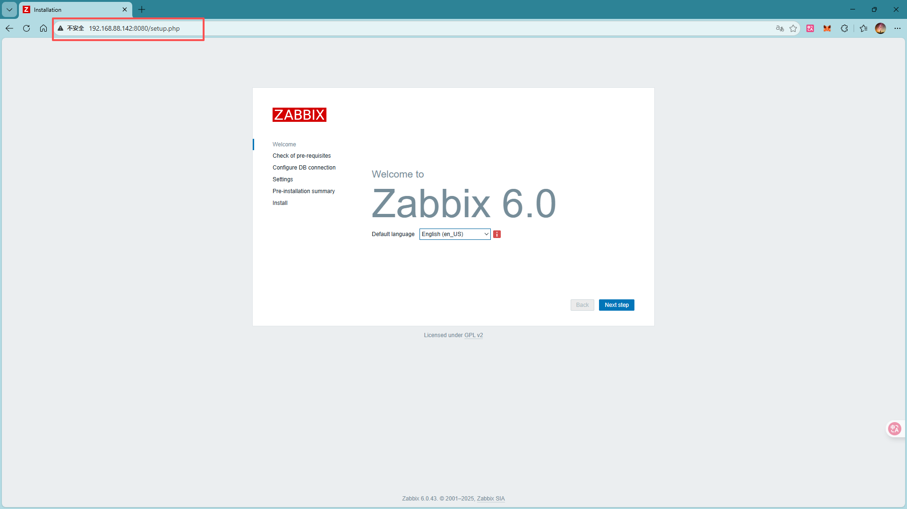

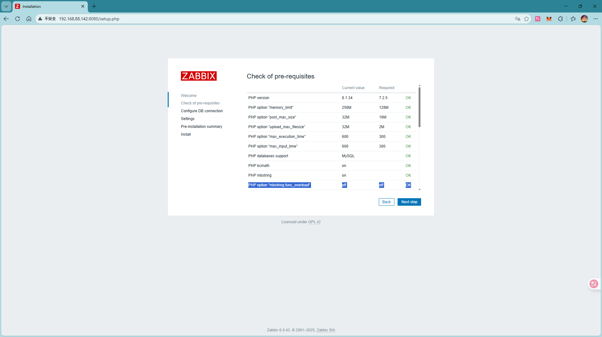

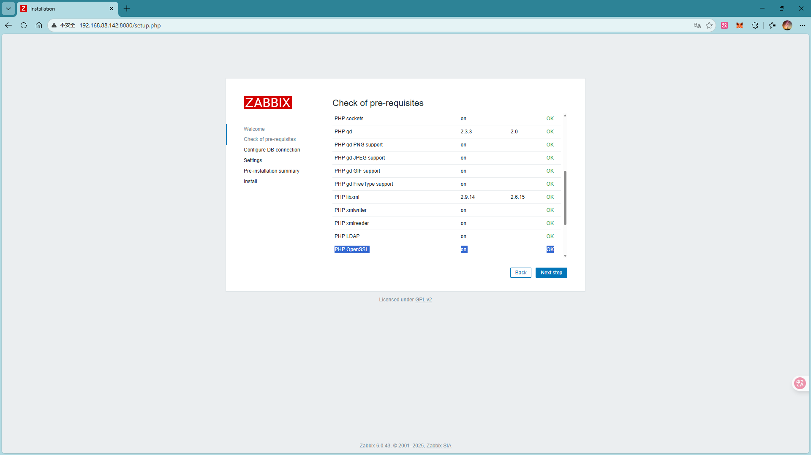

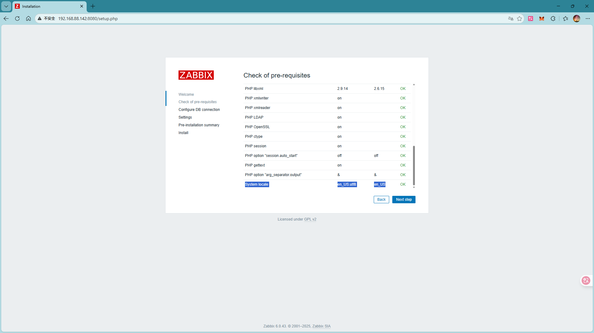

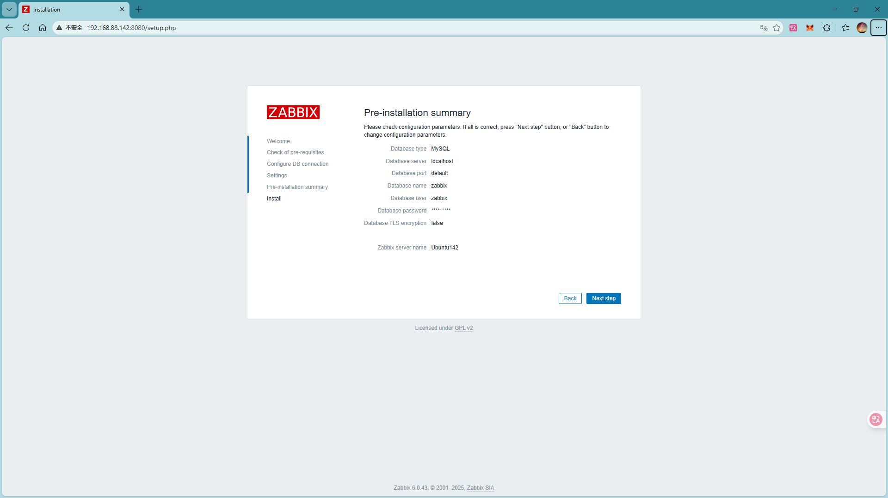

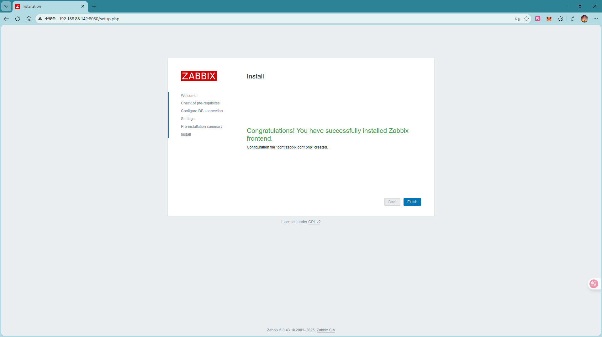

## zabbix-web进入仪表盘页面

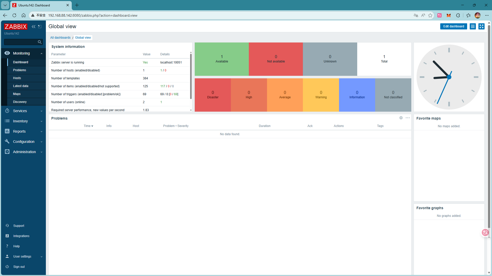

## 配置新增主机192.168.88.135

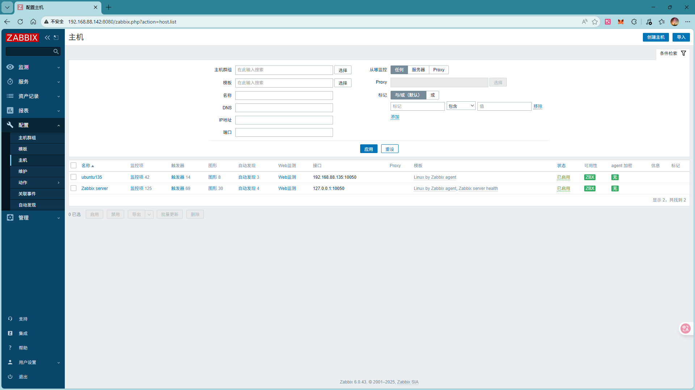

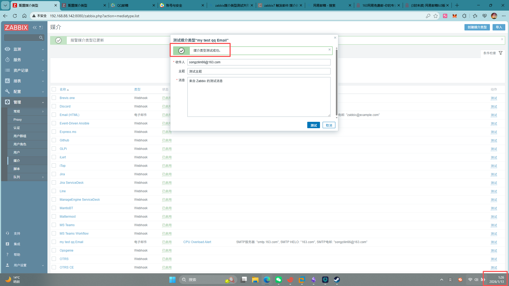

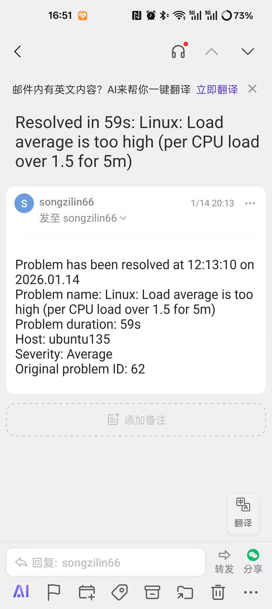

