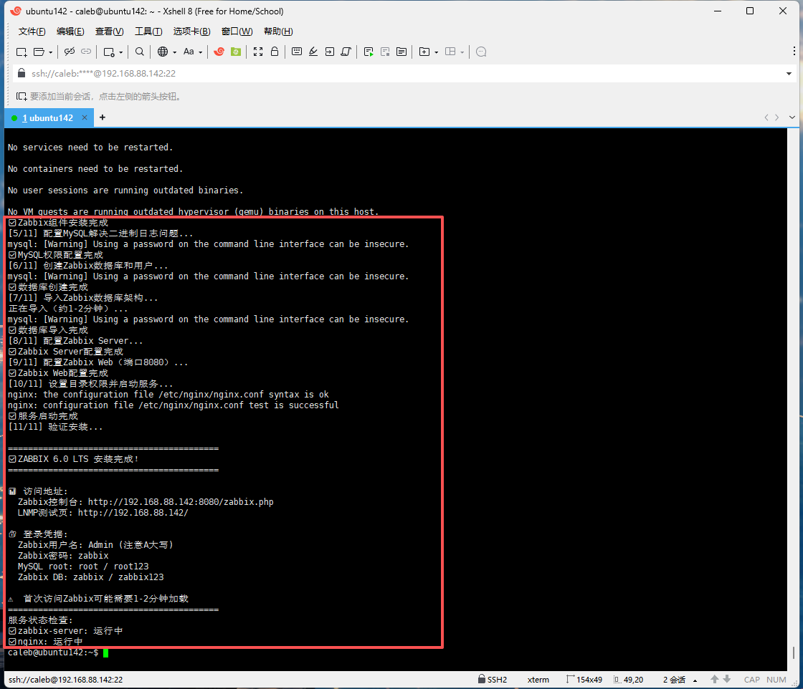

# 🚀 企业级Zabbix监控平台部署与运维实践


## 📋 项目概述
这是一个完整的 企业级监控系统手动部署项目，基于 Zabbix 6.0 LTS 构建。项目详细记录了从零开始部署 LNMP 环境到完整监控系统上线的全流程，包含详细命令、配置说明和排错记录，是学习 Linux 运维和监控系统部署的完整实践案例。

## ✨ 项目亮点
- ✅ **实战导向**：记录了从零部署到故障解决的全过程
- ✅ **问题驱动**：包含10+个典型生产环境问题及解决方案
- ✅ **完整闭环**：从监控部署到自动化运维的全链路实践
- ✅ **文档详尽**：每个步骤都有详细说明和原理分析

## 📦 环境要求
系统要求
操作系统：Ubuntu 22.04 LTS (64位)

内存：至少 2GB RAM (推荐 4GB)

存储：至少 20GB 可用空间

网络：稳定的网络连接，开放端口 80, 443, 10051, 10050

## 📊 技术栈
| 组件 | 版本 | 用途 |
|------|------|------|
| Ubuntu | 22.04 LTS | 基础操作系统 |
| Zabbix | 6.0.43 LTS | 监控系统 |
| MySQL | 8.0.44 | 数据库 |
| Nginx | 1.18.0 | Web服务器 |
| PHP | 8.1.2 | 动态编程语言 |
| Zabbix | Server	6.0 LTS	| 监控服务端
| Zabbix | Agent 2	6.0 LTS	| 监控客户端

# 🚀 完整部署流程
## 第一阶段：系统准备与优化
```
# 更新系统包列表和已安装的包
sudo apt update && sudo apt upgrade -y

# 安装常用工具
sudo apt install -y net-tools curl wget vim htop tree git unzip telnet jq

```
## 第二阶段：搭建LNMP环境（Nginx + MySQL + PHP）
```
## Vim创建脚本
sudo vim Second-LNSP-install.sh
(脚本内容详情见项目目录→Second-LNSP-install.sh)

## 添加脚本执行权限
sudo chmod +x Second-LNSP-install.sh

## 使用一键部署LNSP脚本进行一键安装部署
sudo ./Second-LNSP-install.sh
```
## 第二阶段：搭建zabbix环境

```
## Vim创建脚本
sudo vim Third-zabbix-install.sh
(脚本内容详情见项目目录→Second-LNSP-install.sh)

## 添加脚本执行权限
sudo chmod +x Third-zabbix-install.sh

## 使用一键部署zabbix脚本进行一键安装部署
sudo ./Third-zabbix-install.sh
```
## 安装部署完成页面

------------
